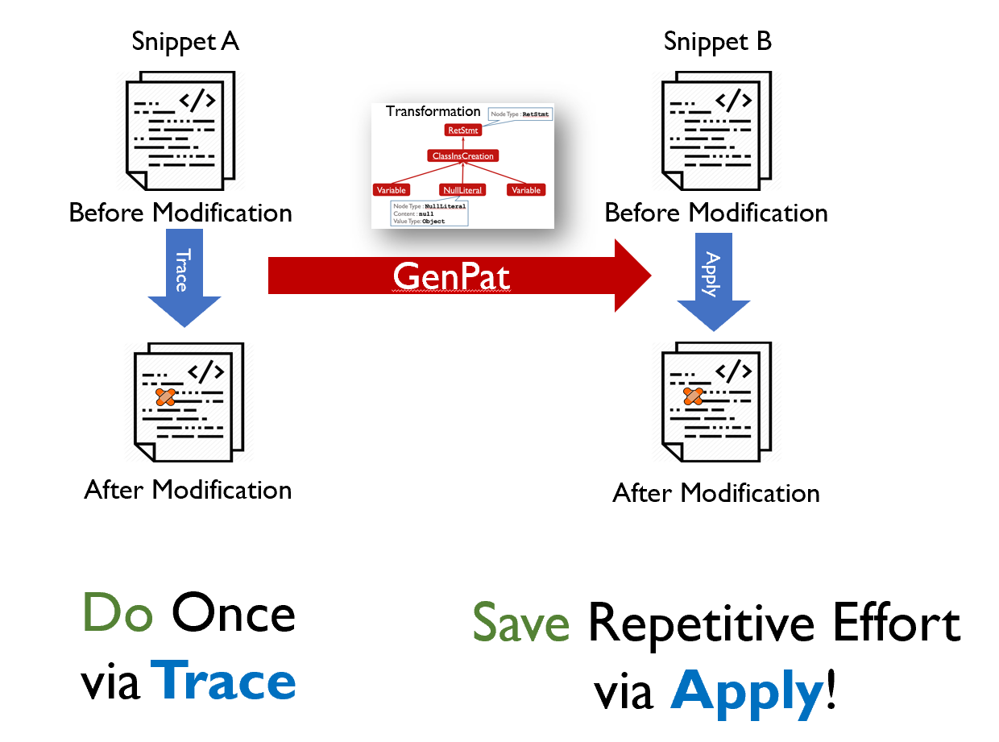
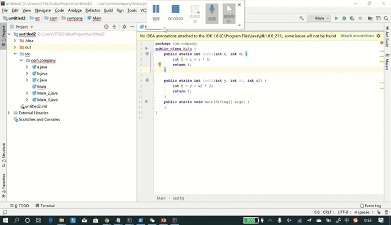

# GenPat-Plugin

### Pipeline

### Demo

### Usage

*Note: Currently, it only supports with transformation at function(method) level.*

Trace (for the transformation generation):

 1. Choose a function (let cursor inside the function)

 2. Start with your modification on the function

    Way A: Click *Trace* button in pop-up menu (right mouse click), or `Shift + Alt + -/_`, then edit in popup editor.

    Way B: Start with  `Shift + Alt + [` , then edit in IDE, finally end with `Shift + Alt + ]`

Apply (for the transformation application):

	1. Choose a target function (let cursor inside the function)
 	2. Click *Apply* button in pop-up menu (right mouse click) or  `Shift + Alt + =/+`

### TODO

1. Another apply way: global search
2. Signature modification
3. Multi candidates

### Publication

Jiajun Jiang, Luyao Ren, Yingfei Xiong, Lingming Zhang. [Inferring Program Transformations From
Singular Examples via Big Code](http://luyaoren.com/wp-content/uploads/ASE19-GENPAT.pdf). In Proceedings of the 34th IEEE/ACM International Conference on
Automated Software Engineering (**ASE ’19**)

